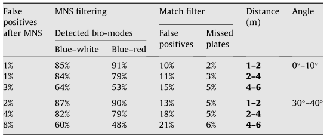

## An edge-based color-aided method for license plate detection (2008 - Elsevier)

    Focus: Iranian license plates. 

They researched on two major areas: to enhance image contrast in plate-like regions, and a novel match filter to eliminate non-plate like regions. Their approach was referenced in many papers. 

## A License Plate-Recognition Algorithm for Intelligent Transportation System Applications (2006 IEEE)

    Focus: USA license plates
    Accuracy: Total = 86.0%
        Segmentation = 96.5%
        Recognition = 89.1%

This paper provides an in-dept literature review. 

> In this paper, an algorithm implementing a novel adaptive image segmentation technique (SCWs) and connected component analysis is considered for license plate location and character segmentation. For the OCR task, a PNN with topology 108-180-36 is trained to identify alphanumeric characters, which were previously isolated from the candidate area.

## Bangladeshi Vehicle Digital License Plate Recognition for Metropolitan Cities Using Support Vector Machine (2016 - ICAICT)

    Target: Bangladesh
    Accuracy: Overall = 91.3%
        Detection: 93.2%
        Segmentation: 98.1%
        Recognition: 99.2%

Vertical sobel operator is used to get edge image. Dilation and erosion applied aftwards to highlight plate area. Extracted plate area is converted to binary image using adaptive thresholding utilizing convolution.

For segmentation, connected component analysis is done. Then bounding box is calculated and aspect ratio is observed to choose a character.

2D Gabor filter is used for feature extraction. City name is kept intact. Finally an SVM with KPCA is used for character recognition.

## 
